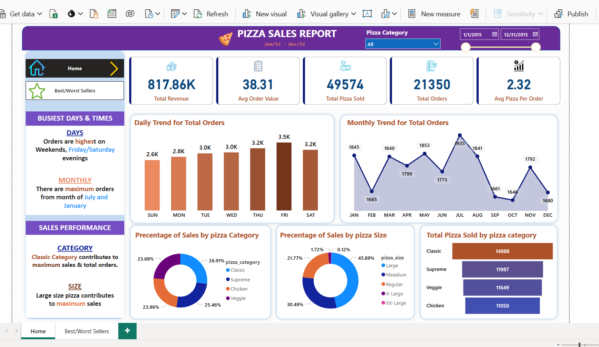
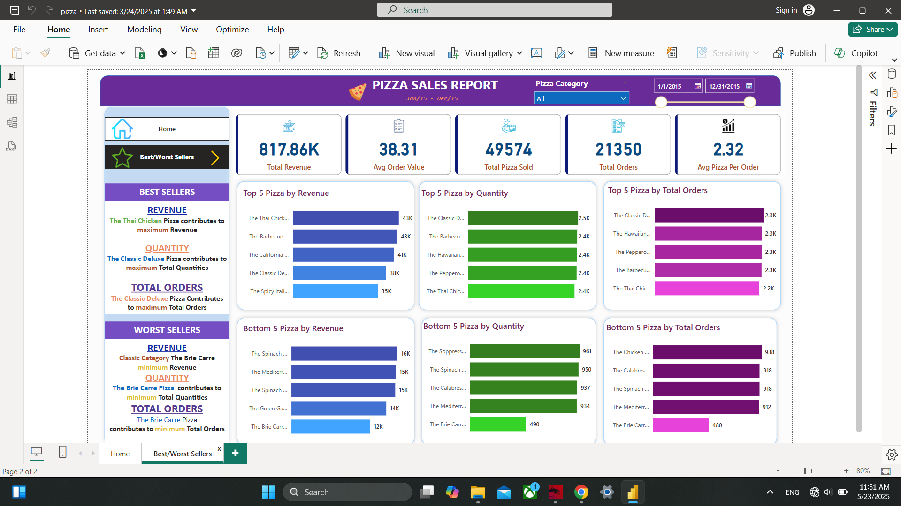

 # Pizza Sales Analysis with Power BI 🍕📊

Excited to share my interactive Power BI dashboard built to analyze and visualize pizza sales performance across categories, sizes, and order times. This project dives deep into customer behavior and operational trends using real-world pizza order data to support data-driven decisions in the food industry.

## 🔍 Key Features:
✅ Total Revenue, Order Count & Average Order Value Overview 💰

✅ Sales Breakdown by Pizza Category (Classic, Veggie, Chicken, etc.) 🍕

✅ Best & Worst Selling Pizzas by Revenue and Quantity 📈

✅ Time-Based Sales Trends (Hourly, Daily, Weekly Patterns) ⏱️

✅ Dynamic Filtering by Pizza Type, Size, and Order Date 📊

✅ Interactive KPI Cards, Slicers, and Drill-Through Reports 🎛️

By transforming raw Excel data into engaging, actionable visuals, this dashboard offers a clear view of what drives performance and profit in the pizza business. A great step toward smarter restaurant analytics and decision-making!

## 📊 Pizza Sales Performance Dashboard

• Developed an interactive Power BI dashboard using historical pizza order data to analyze key business metrics such as total revenue, order quantity, and average order value.
• Conducted data cleaning and transformation using Power Query in Excel and Power BI to prepare and normalize data for visualization.
• Created dynamic visuals including bar charts, line graphs, slicers, and KPIs to display category-wise sales, time-based trends, and product performance.
• Identified best-selling and least-selling pizza types by combining DAX measures with dynamic filtering, enabling performance benchmarking.
• Used time series trends to uncover peak order times (by day/hour), aiding in staff planning and promotional strategies.
• Enabled data-driven decisions such as:

Optimizing inventory based on top-selling pizza types and sizes

Focusing marketing efforts on underperforming categories

Adjusting business hours based on hourly demand insights

Tools and Technologies:
Power BI | Power Query | DAX | Excel | Data Cleaning | KPI Design | Sales Dashboard
